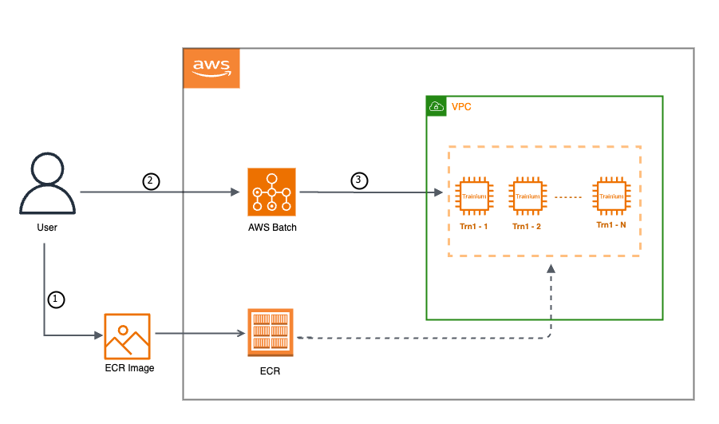

# Training the Llama2 7B Model with AWS Batch and Trainium

This example demonstrates how to train the Llama2 7B model using AWS Batch with Trainium. AWS Batch offers a scalable and cost-effective solution for executing batch computing workloads in the AWS Cloud. By seamlessly integrating Trainium with AWS Batch, you can achieve an efficient and cost-effective approach to train deep learning models at scale.
The following example is an adoption of Llama2 - 7B tutorial originally published under the [Neuronx-Distributed Docs](https://awsdocs-neuron.readthedocs-hosted.com/en/latest/libraries/neuronx-distributed/tutorials/training_llama2_7b.html#llama2-7b-tp-zero1-tutorial).

## AWS Batch with Trainium

As illustrated in the below diagram, running jobs on AWS Batch require a few resources to be prepared. To learn more about setting up AWS Batch with Trainium, please refer to the official [Neuron Documentation](https://awsdocs-neuron.readthedocs-hosted.com/en/latest/general/devflows/training/batch/batch-training.html#batch-training).

## Prerequisite infrastructure

It is advised not to execute these scripts on your local machine. Instead, it is recommended to clone this GitHub repository and run the provided scripts on an x86_64-based instance, preferably utilizing a `C5.xlarge` instance type with the Linux/Ubuntu operating system.

Below is the list of resources and tools you should have before getting started with the training on AWS Batch. 

### VPC Creation
For this example you would require a VPC that has at least two subnets(one public and one private), and a Network Address Translation (NAT) gateway. Please follow the instructions mentioned [here](https://docs.aws.amazon.com/appstream2/latest/developerguide/managing-network-internet-NAT-gateway.html) on how to create a VPC with NAT Gateway.

### ECR Repo 
You would also need and ECR repo to store our docker container image. Please follow instructions [here](https://docs.aws.amazon.com/AmazonECR/latest/userguide/repository-create.html) on how to create an ECR repo.

### S3 Bucket
An Amazon Simple Storage Service (S3) bucket would be required for the storage of tokenized datasets, Neuron compile cache artifacts, and Llama checkpoint files. Learn more about it [here](https://docs.aws.amazon.com/AmazonS3/latest/userguide/creating-bucket.html).

### IAM Role
An IAM role would be needed which will be associated with the Trn1 instances. please ensure this role has `AmazonEC2ContainerServiceforEC2Role` and `AmazonS3FullAccess` policies associated with it. To learn more about IAM Roles, refer [here](https://docs.aws.amazon.com/IAM/latest/UserGuide/id_roles_create.html).

### AWS CLI
AWS CLI should be installed and configured with permissions for Batch and ECR. You can follow the instructions mentioned [here](https://docs.aws.amazon.com/cli/latest/userguide/getting-started-install.html) to install AWS CLI. 

### Other Tools
`Docker` and `jq` should also be installed.

## Getting Started with Llama training on AWS Batch with Trainium

### Configuration Update

Let's begin by updating the `config.txt` file to specify values for the following variables:

    REGION                      # your aws region
    SUBNET                      # your subnet in which the Trainium instances would be launched
    SG                          # your security group you want to associate with your instances
    ECR_REPO                    # your ECR repo where the docker container image will be pushed to
    INSTANCE_ROLE               # Instance profile ARN for your IAM Instance Role
    DO_PRE_COMPILATION          # boolean value (true\false) indicating if you want to do neuron pre-compilation for your training job
    TOKENIZED_DATASET_URI       # s3 uri to store the tokenized dataset
    NEURON_COMPILE_CACHE_URI    # s3 uri to store the neuron compile caches
    CHECKPOINT_SAVE_URI         # s3 uri to store the checkpoints

So after providing these values, your `config.txt` should look something like this:

    REGION=us-east-1
    SUBNET=subnet-012345abcd5689
    SG=sg-012345abcd5689
    ECR_REPO=1010101010.dkr.ecr.us-east-1.amazonaws.com/your-docker-repo
    INSTANCE_ROLE=arn:aws:iam::1010101010:instance-profile/your-instance-role
    DO_PRE_COMPILATION=true
    TOKENIZED_DATASET_URI=s3://your/s3/location/to/store/tokenized/dataset/
    NEURON_COMPILE_CACHE_URI=s3://your/s3/location/to/store/neuron-compile-cache/
    CHECKPOINT_SAVE_URI=s3://your/s3/location/to/store/checkpoints/

Furthermore, for data tokenization, it is imperative to obtain the tokenizer from HuggingFace and Meta. Detailed instructions for acquiring the tokenizer are available [here](https://huggingface.co/meta-llama/Llama-2-7b). It is crucial to bear in mind that utilizing the Llama 2 model is contingent upon adhering to the Meta license.

Before proceeding to download the model weights and tokenizer, please visit the specified website and acknowledge the accompanying license terms. After gaining access, utilize the scripts provided by Meta to obtain the model weights and tokenizer. Upon completion of the download, make sure to place the `tokenizer.model` in the root directory (`\llama2`).

### Trigger Llama2-7B training job on AWS Batch
To initiate the training process on `AWS Batch using Trainium`, execute the following scripts in the specified sequence.

#### 1. setup.sh

This script streamlines the pre-requisite steps essential for initiating the AWS Batch training. It downloads sample files required to train the model along with creating some additional files and directories.  Once executed, it ensures that your directory structure aligns with the required setup.

    .
    ├── build
    │   ├── compute_env.json
    │   ├── job_def.json
    │   ├── job_queue.json
    │   └── launch_template.json
    ├── build_and_push_docker_image.sh
    ├── config.txt
    ├── create_resources.sh
    ├── data
    │   ├── get_dataset.py
    │   ├── config.json
    │   └── tokenizer.model
    ├── docker
    │   ├── Dockerfile
    │   ├── llama2
    │   │   ├── adamw_fp32_optim_params.py
    │   │   ├── config.json
    │   │   ├── llama_batch_training.sh
    │   │   ├── modeling_llama_nxd.py
    │   │   ├── requirements.txt
    │   │   └── tp_zero1_llama2_7b_hf_pretrain.py
    │   └── llama_batch_training.sh
    ├── download_and_tokenize_data.sh
    ├── images
    │   └── aws-batch.png
    ├── README.md
    ├── scripts
    │   ├── build_and_push_docker_image.sh
    │   ├── create_resources.sh
    │   ├── download_and_tokenize_data.sh
    │   └── submit_batch_job.sh
    ├── setup.sh
    ├── submit_batch_job.sh
    └── templates
        ├── compute_env.json
        ├── job_def.json
        ├── job_queue.json
        └── launch_template.json

#### 2. download_and_tokenize_data.sh

This script handles the necessary data pre-processing steps required for training the Llama2-7B model. In this illustration, we utilize the `wikicorpus` dataset from Huggingface (learn more about it [here](https://huggingface.co/datasets/wikicorpus) ). Upon downloading the dataset, the script proceeds to tokenize it and then uploads the tokenized dataset to the pre-defined S3 location specified in the config.txt file. 

#### 3. create_resources.sh
The script orchestrates the provisioning of essential resources required for the training job. This includes the creation of a Placement Group, Launch Template, Compute Environment, Job Queue, and Job Definition.

#### 4. build_and_push_docker_image.sh
This script constructs a Docker container image tailored for our training job. This image encompasses instructions for executing Llama2 - 7B training on Trainium, utilizing the `neuronx_distributed` library with `Tensor Parallelism` and the `ZeRO-1 Optimizer`. Afterward, the recently generated Docker container image is uploaded to your Amazon Elastic Container Registry (ECR) repository mentioned as `ECR_REPO` in config.txt. 

##### Note: 
After running setup.sh, you will be able to find the hyperparameters for Llama2-7B training job in `./docker/llama2/llama_batch_training.sh`. If you wish to modify any of these hyperparameters, please make the required changes in this file before running `build_and_push_docker_image.sh`.

#### 5. submit_batch_job.sh
This script submits the AWS Batch job to commence the Llama2 model training. Upon submission, an `ECS Cluster` is dynamically established. Once operational, you can navigate through the cluster to monitor all tasks actively running on the `Trn1.32xl` instances, launched through this job.
By default, this example is configured to run on 4 trn1.32xl instances. If you wish to customize this setting, you can do so by modifying the `numNodes` parameter in the `submit_batch_job.sh` script.

Once the job is submitted, you can use `Amazon CloudWatch` Logs to monitor, store, and view all your logs from AWS Batch. Refer to [the documentation](https://docs.aws.amazon.com/batch/latest/userguide/batch-eks-cloudwatch-logs.html) for additional details and insights into the logging process. 

The checkpoints will be stored in the predefined S3 location specified as `CHECKPOINT_SAVE_URI` in the config.txt file. By default, the checkpoint is saved once at the conclusion of training. However, you have the flexibility to alter this behavior by choosing to save the checkpoint after every N steps within the training loop. For more information on this, please refer [NxD Checkpointing Dev Guide](https://awsdocs-neuron.readthedocs-hosted.com/en/latest/libraries/neuronx-distributed/tutorials/training_llama2_7b.html#checkpointing).

#### 5. cleanup.sh
After completing this tutorial, you can execute this cleanup script, which will handle the removal of resources generated during the tutorial. This includes the launch template, placement group, job definition, job queue, and compute environment. It's worth noting that AWS Batch automatically handles the cleanup of the ECS stack and Trainium instances, so there's no need to explicitly remove or stop them.
